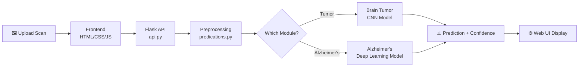

<div align="center">


<br/>

<p>
  
  
  
  
  
</p>

<br/>

> **🏥 Bringing clinical-grade AI to medical imaging — early detection of brain tumors and Alzheimer's disease through deep learning.**

</div>

---

## 🧭 Table of Contents

- [Overview](#-overview)
- [Modules](#-modules)
- [How It Works](#️-how-it-works)
- [Tech Stack](#-tech-stack)
- [Project Structure](#-project-structure)
- [Setup & Run](#-setup--run)
- [Model Performance](#-model-performance)
- [Screenshots](#-screenshots)

---

## 🌟 Overview

**CodeCure** is a full-stack medical AI web application that assists in the early detection of two of the most challenging neurological conditions:

| Module | Condition | Approach |
|:---:|:---:|:---:|
| 🔴 **TumorScan** | Brain Tumor Detection | CNN on MRI scans |
| 🟣 **AlzheimerScan** | Alzheimer's Detection | Deep Learning on brain imagery |

The platform combines a trained deep learning backend with an intuitive web interface — making powerful diagnostic AI accessible without specialized infrastructure.

---

## 📦 Modules

### 🔴 TumorScan — Brain Tumor Classifier

Analyzes MRI scans to detect and classify brain tumors.

```
Input: MRI scan image
Output: Tumor / No Tumor + confidence score
Model: Convolutional Neural Network (CNN)
Training: tumor_model_training.ipynb
```

### 🟣 AlzheimerScan — Alzheimer's Stage Detector

Classifies Alzheimer's progression from brain scan imagery.

```
Input: Brain scan image
Output: Stage classification + probability
Model: Deep CNN
Interface: alz.html / alz.js / alz.css
```

---

## ⚙️ How It Works



### Pipeline Steps

```
① User uploads MRI/brain scan via web interface
② Flask server receives image via API endpoint
③ predications.py preprocesses and normalizes the scan
④ Trained deep learning model runs inference
⑤ Result (class + confidence %) displayed on screen
```

---

## 🧰 Tech Stack

<div align="center">

| Layer | Technology |
|:---:|:---:|
| **Frontend** | HTML5, CSS3, Vanilla JavaScript |
| **Backend** | Python, Flask |
| **AI/ML** | TensorFlow / Keras |
| **Training** | Jupyter Notebook |
| **Deployment** | GitHub Pages + Python Server |
| **Containerization** | GitHub Actions CI/CD |

</div>

---

## 📁 Project Structure

```
code_cure/
│
├── 🧠 tumor_model_training.ipynb   # CNN training pipeline for tumor detection
├── 🔬 server.ipynb                 # Jupyter server runner
│
├── 🌐 index.html                   # Main landing page
├── 🔴 tmr.html / tmr.css / tmr.js  # Tumor Scanner UI
├── 🟣 alz.html / alz.css / alz.js  # Alzheimer's Scanner UI
│
├── ⚙️  api.py                      # Flask REST API
├── 🔮 predications.py              # Inference + preprocessing logic
├── 🖥️  server.py                   # Server entry point
│
├── 📦 requirements.txt             # Python dependencies
├── 🖼️  model.png                   # Model architecture diagram
└── 📁 .github/workflows/           # CI/CD pipeline
```

---

## 🚀 Setup & Run

### 1. Clone the Repository

```bash
git clone https://github.com/avinashmaharoliya/code_cure.git
cd code_cure
```

### 2. Install Dependencies

```bash
pip install -r requirements.txt
```

### 3. Start the Server

```bash
python server.py
```

### 4. Open in Browser

```
http://localhost:5000
```

> Or visit the live GitHub Pages deployment directly.

---

## 📊 Model Performance

| Model | Task | Architecture |
|:---:|:---:|:---:|
| Tumor Detector | Binary Classification | CNN (custom) |
| Alzheimer's Detector | Multi-class Classification | Deep CNN |

> Training details and evaluation metrics available in `tumor_model_training.ipynb`

---

## 🔮 Future Scope

- [ ] 🧠 Multi-class tumor classification (glioma, meningioma, pituitary)
- [ ] 📈 Grad-CAM heatmap visualization for explainability
- [ ] 📱 Mobile-responsive redesign
- [ ] 🔒 HIPAA-compliant patient data handling
- [ ] 🌍 Multi-language support for global accessibility

---

## 📌 Note

> CodeCure is a **research prototype** and is **not intended for clinical diagnosis**. Always consult a certified medical professional for any health concerns.

---

<div align="center">


*Built with ❤️ to make early detection accessible to all.*

</div>
